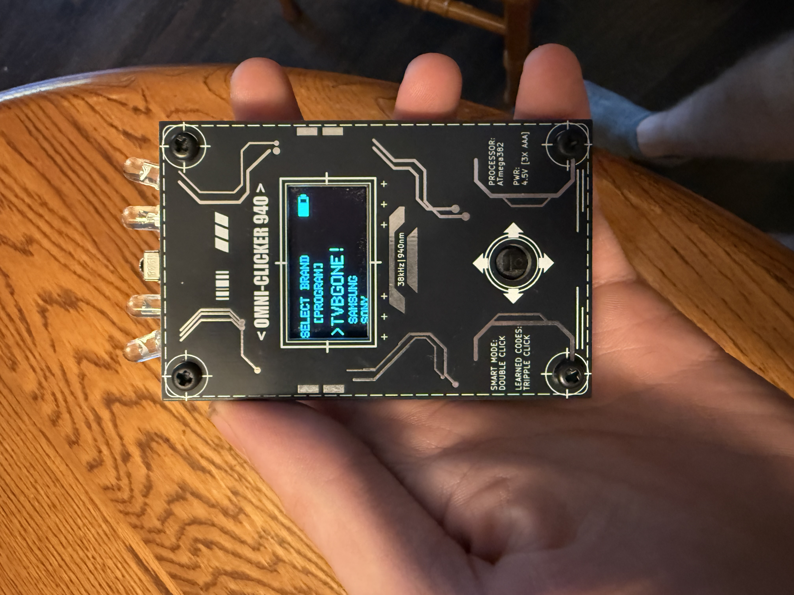
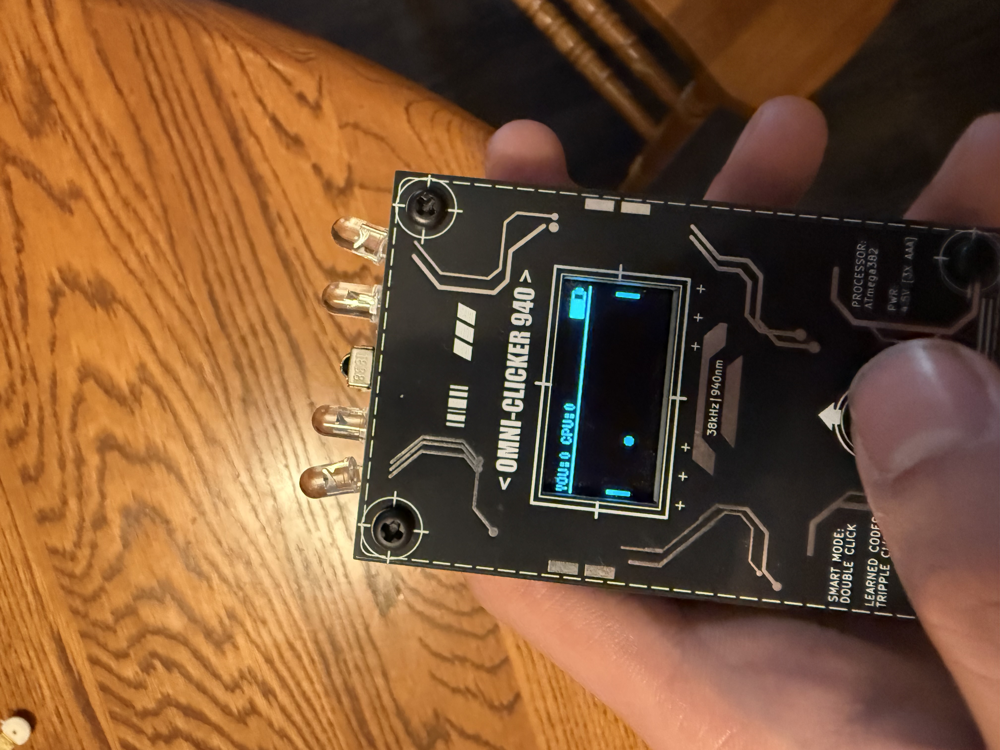

Pocket-IR: Credit-Card Sized Universal Remote & Embedded Gaming Console
A bare-metal ATmega328P embedded system featuring sub-pixel physics game rendering, raw EEPROM IR pulse learning, a 29-code TV-B-Gone sequence, and ultra-low-power deep sleep management. Designed on a 55x85mm credit-card footprint powered directly by 3x AAA batteries.

## Project Images

System Specifications

Subsystem	Components & Implementations
Microcontroller	ATmega328P running @ 8MHz internal clock, 6-pin ISP flashing header[cite: 1]
Display	1.3" SH1106 OLED (128x64) driven over 4-wire Hardware SPI[cite: 1, 8]
IR Output	Quad-IR LED array (driven via N-MOSFET, 10Ω ballast resistors, 1000µF smoothing cap)[cite: 1]
IR Input	38kHz active IR receiver module[cite: 1]
Audio	MLT8530 piezo buzzer with software frequency synthesis[cite: 1, 2]
Power	3x AAA Direct Drive (3.0V – 4.5V range) with internal bandgap voltage sensing[cite: 3]
Input	5-Way Navigation Switch (Up, Down, Left, Right, Center Click)[cite: 1]
Enclosure	Dual-layer PCB sandwich construction with M3 nylon standoffs (55x85mm)[cite: 1]

Key Engineering Features

Smart Layer Input Engine: Supports Single-Click (Context Action), Double-Click (Smart/Normal Layer toggle), and Triple-Click (Learned vs. Preset swap) on a single physical center switch.  

Zero-Pin Battery Gauge: Measures internal supply voltage (V 
CC
​
 ) against an internal 1.1V reference, eliminating voltage divider power leakage and saving GPIO pins[cite: 3].

Sub-Pixel Floating-Point Physics: Smooth Pong gaming rendered on a 128x64 canvas via sub-pixel float trajectories, vector reflections, and dynamic speed multipliers.  
Unknown

PROGMEM Signal Blaster: Asynchronous execution of 29 IR power routines stored in Flash memory, paired with dynamic progress bar rendering[cite: 9].

Non-Volatile Signal Learning: Captures raw IR protocols, address bits, and command structures into non-volatile EEPROM storage[cite: 4].

Software Architecture Deep Dives

1. Zero-Pin Bandgap Battery Sensing (readVcc)
Instead of using an external voltage divider—which constantly draws current or requires an extra GPIO pin to switch—the system measures V 
CC
​
   internally[cite: 3]. By selecting the internal 1.1V bandgap voltage as the ADC input and setting V 
CC
​
   as the ADC reference, the microcontroller back-calculates the exact operating voltage[cite: 3].

V 
CC
​
 (mV)= 
ADC Reading
1.1V×1023×1000
​
  
C++
long readVcc() {
  #if defined(__AVR_ATmega328P__) || defined(__AVR_ATmega168P__)
    ADMUX = _BV(REFS0) | _BV(MUX3) | _BV(MUX2) | _BV(MUX1); // Select 1.1V Bandgap
  #endif   
  delay(2); // Wait for Vref to settle
  ADCSRA |= _BV(ADSC); // Start conversion
  while (bit_is_set(ADCSRA, ADSC)); // Wait for conversion
  uint8_t low  = ADCL; 
  uint8_t high = ADCH; 
  long result = (high << 8) | low;
  return 1125300L / result; // Returns Vcc in millivolts[cite: 3]
}
2. Multi-Click & Debounce Input State Machine
The 5-way switch leverages a debouncing and timing window engine inside handleRemoteInput(). It calculates differential release times to distinguish between single-clicks, layer switches, and prol...
Unknown
+ 1

C++
// Excerpt: Non-blocking Multi-Click Resolution Engine
if (clickCount > 0 && debouncedClickState == HIGH) {
  if (now - lastReleaseTime > MULTI_CLICK_GAP) {
    if (clickCount == 1)      cmd = isSmartMode ? CMD_SELECT : CMD_MUTE;[cite: 6]
    else if (clickCount == 2) { isSmartMode = !isSmartMode; playSmartModeSound(); }[cite: 6]
    else if (clickCount >= 3) { toggleLearnedMode(); }[cite: 6]
    clickCount = 0; 
  }
}
3. Sub-Pixel Ball Physics Engine
To prevent motion stuttering on low-resolution monochrome OLED screens, ball position and velocity are calculated using floating-point operations. The coordinates are cast to integers only at the [...]

C++
// Floating-point vector update with speed multiplier
ballX += (ballVx * speedMult);[cite: 8]
ballY += (ballVy * speedMult);[cite: 8]

// Dynamic Paddle Reflection Math
float hitOffset = ballY - (playerY + 7.0); 
ballVx = 2.0; 
ballVy = hitOffset * 0.25; // Imparts spin based on paddle contact point

Engineering Trade-Offs & Challenges

Hardware SPI vs. I2C Bus Bottlenecks
Problem: Standard I2C OLED screens at 400kHz refreshed too slowly, creating visible screen tearing and input lag during game rendering loops[cite: 1].

Solution: Switched to a 4-wire Hardware SPI interface using dedicated MOSI and SCK pins[cite: 1, 8]. Frame rendering time dropped significantly, allowing the loop to maintain a stable ~60 FPS rat...
Unknown

Battery Direct Drive vs. Power Boost Converter
Problem: Boost converters add switching noise, increase PCB component counts, and reduce passive battery runtime due to baseline quiescent current draw.

Solution: Configured the ATmega328P to run at an 8MHz internal clock[cite: 1]. This allowed safe microcontroller operation down to 2.7V, enabling direct power supply from 3x AAA batteries (3.0V …...

Timer Collision Mitigation (safeTone)
Problem: Standard hardware timer-based tone generation (tone()) corrupted the timing registers used by IRremote during signal transmission[cite: 2].

Solution: Built a bit-banged PWM audio synthesizer function (safeTone) that runs directly off software timing loops during active playback, preserving system hardware timers for IR carrier genera[...]

PCB Hardware & Layout

Dimensions: 55mm x 85mm (Credit Card Form Factor)[cite: 1].

Assembly Strategy: Hybrid approach—JLCPCB surface-mount assembly (SMT) for passives and ICs, coupled with manual hand-soldering for high-stress through-hole (THT) connectors, switch, and OLED p[...]

Protective Sandwich: Decorative faceplate fabricated from standard PCB substrate mounted with four M3 nylon standoffs to protect the screen[cite: 1].

How to Build & Flash

Hardware Prerequisites: USBasp or Arduino as ISP Programmer, 6-Pin ISP Cable[cite: 1].

Software Dependencies:

U8g2lib

IRremote

LowPower

[cite: 8]

Compilation Settings:

Board: ATmega328P (3.3V / 8MHz internal clock)[cite: 1]

Clock: Internal 8 MHz[cite: 1]

Flash using ISP header on board[cite: 1].
