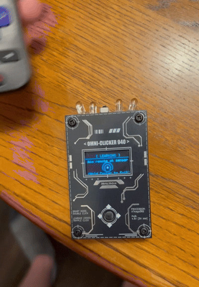

# Pocket-IR: Credit-Card Sized Universal Remote & Signal Learning System

A bare-metal ATmega328P embedded system capable of learning, decoding, and storing arbitrary 38kHz IR signals into EEPROM, providing full multi-brand TV control (volume, channels, menu navigation), and executing a 29-code universal power blasting sequence. Designed on a 55x85mm credit-card footprint powered directly by 3x AAA batteries.


---

## 🛠️ System Specifications

| Subsystem | Components & Implementations |
|-----------|------------------------------|
| **Microcontroller** | ATmega328P running @ 8MHz internal clock, 6-pin ISP flashing header |
| **Display** | 1.3" SH1106 OLED (128x64) driven over 4-wire Hardware SPI |
| **IR Transmitter** | Quad-IR LED array driven via N-MOSFET, 10Ω ballast resistors, 1000µF smoothing cap |
| **IR Receiver** | 38kHz active IR receiver module for signal decoding and learning |
| **Preset Controls** | Full control (Volume, Channel, Mute, Nav, Select) for 9 brand presets |
| **Audio Synthesizer** | MLT8530 piezo buzzer driven via non-interfering PWM frequency synthesizer |
| **Power Supply** | 3x AAA Direct Drive (3.0V – 4.5V operating range) with internal bandgap sensing |
| **User Interface** | 5-Way Navigation Switch (Up, Down, Left, Right, Center Click) |
| **Enclosure** | Dual-layer PCB sandwich with M3 nylon standoffs (55x85mm) |

---

## ⚡ Key Engineering Features

.gif)

### 38kHz Signal Capture & Storage
Receives any 38kHz IR command, decodes the protocol, address, and command data, and saves it into non-volatile EEPROM across 10 customizable input slots.

### Full Multi-Brand TV Remote Engine
Out-of-the-box support for Samsung, Sony, LG, Roku, Vizio, Panasonic, Toshiba, Hisense, and Apple TV. Drives Volume, Channel, Mute, Directional Navigation, and Selection commands.

### Dual-Layer Input Mapping
Integrated switch engine supports single-clicks, double-clicks (layer toggle between Normal and Smart modes), and holds, expanding the 5-way switch into 10 distinct IR transmission channels.

### 29-Code Universal Blaster
Executes a sequence of 29 PROGMEM-stored power commands across major TV brands, streaming sticks, and cable boxes with an on-screen progress bar.

### Zero-Pin Battery Monitor
Measures supply voltage (VCC) internally against the ATmega328P bandgap reference, avoiding external voltage dividers and saving power/pins.

### Bonus Sub-Pixel Game Engine
Includes an embedded Pong mini-game utilizing floating-point sub-pixel physics for frame rendering at ~60 FPS.

---

## 🧠 Software Architecture Deep Dives

### 1️⃣ 38kHz Signal Capture & EEPROM Storage Engine

When capturing a remote control signal, the active IR receiver samples the incoming 38kHz bursts. The software decodes the protocol enum, address bitmask, and command code, then serializes the payload directly into non-volatile EEPROM.

**Code:**
```cpp
// IR Slot Data Structure (6 Bytes total)
struct IRSlot {
  uint8_t protocol;
  uint32_t address;
  uint32_t command;
};

// Serializing captured IR data to EEPROM slot
int addr = EEPROM_START_ADR + (assignedSlot * sizeof(IRSlot));
EEPROM.put(addr, captured);
```



### 2️⃣ Multi-Brand Protocol Translator

Rather than storing bloated raw pulse arrays for standard electronics, the system stores protocol-specific hex maps in Flash memory. The execution loop dynamically routes standard commands (CMD_VOL_UP, CMD_NAV_LEFT, etc.) into brand-specific encoding functions.

**Code:**
```cpp
// Excerpt: Brand-Specific Protocol Routing
if (strcmp(brand, "SAMSUNG") == 0) {
  switch(cmd) {
    case CMD_VOL_UP: hex = 0x07; break;
    case CMD_NAV_UP: hex = 0x60; break;
    // ...
  }
  IrSender.sendSamsung(0x0707, hex, 0);
} else if (strcmp(brand, "SONY") == 0) {
  // SONY SIRCS requires 12-bit / 3-repeat frames
  IrSender.sendSony(0x01, hex, 2, 12);
}
```

### 3️⃣ Zero-Pin Bandgap Battery Sensing (readVcc)

To prevent parasitic battery drain through resistor dividers, supply voltage is computed internally. The internal 1.1V reference (VREF) is connected to the ADC multiplexer while VCC acts as the reference voltage.

**Formula:**
```
VCC (mV) = (1.1V × 1023 × 1000) / ADC Reading
```

**Code:**
```cpp
long readVcc() {
  #if defined(__AVR_ATmega328P__) || defined(__AVR_ATmega168P__)
    ADMUX = _BV(REFS0) | _BV(MUX3) | _BV(MUX2) | _BV(MUX1); // 1.1V Bandgap Reference
  #endif   
  delay(2); // Settling delay
  ADCSRA |= _BV(ADSC); // Start conversion
  while (bit_is_set(ADCSRA, ADSC)); // Wait for completion
  uint8_t low  = ADCL; 
  uint8_t high = ADCH; 
  long result = (high << 8) | low;
  return 1125300L / result; // Calculate mV
}
```

---

## ⚖️ Engineering Trade-Offs & Solutions

### Hardware SPI vs. I2C Bus Bottlenecks
**Problem:** Standard I2C OLED screens operating at 400kHz caused noticeable input lag during menu updates and screen redraws.

**Solution:** Switched to a 4-wire Hardware SPI interface using dedicated MOSI and SCK pins. Frame transfer execution dropped significantly, allowing instant UI redraws and high frame rates for graphics.

### Battery Direct Drive vs. Boost Converter Efficiency
**Problem:** Step-up boost converters add high-frequency switching noise, increase PCB component counts, and consume quiescent current during standby.

**Solution:** Running the ATmega328P at an 8MHz internal clock allows the microcontroller to operate down to 2.7V safely. This enabled direct drive operation from 3x AAA batteries (3.0V – 4.5V range) with microamp deep sleep current draw.

### Timer Collision Resolution (safeTone)
**Problem:** Standard hardware timer audio functions (tone()) interfere with timer registers needed by IRremote for precise 38kHz modulation.

**Solution:** Engineered safeTone(), a custom bit-banged audio driver that manages piezoelectric frequencies using microsecond delay loops, leaving internal hardware timers completely dedicated to IR transmission.

---

## 📸 Hardware Design & Enclosure

**Form Factor:** 55mm x 85mm Credit Card Dimensions.

**Assembly Process:** SMT assembly for small surface-mount passives combined with hand-soldered through-hole components for structural parts (switch, headers, and display pins).

**Protective Enclosure:** Industrial aesthetic featuring an unpopulated PCB panel repurposed as a protective front faceplate, secured via four M3 nylon screws and standoffs.


---

## 📦 Build & Flash Instructions

### Hardware Requirements
- USBasp or Arduino as ISP programmer connected to the onboard 6-pin ISP header

### Required Libraries
- U8g2lib
- IRremote
- LowPower

### Board Configuration
- **Target:** ATmega328P
- **Clock:** Internal 8MHz

Compile and flash via ISP header.
